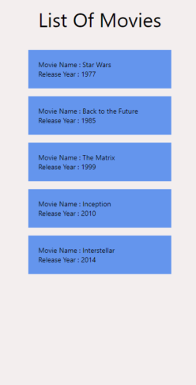

# MoviesApp

built using <strong>TypeScript and React Native </strong>- Expo application development framework.

<h2>Features :</h2>

1. The application should open with a splash screen
2. the application has one screen contains a list of movies

<h2>Picture</h2>

